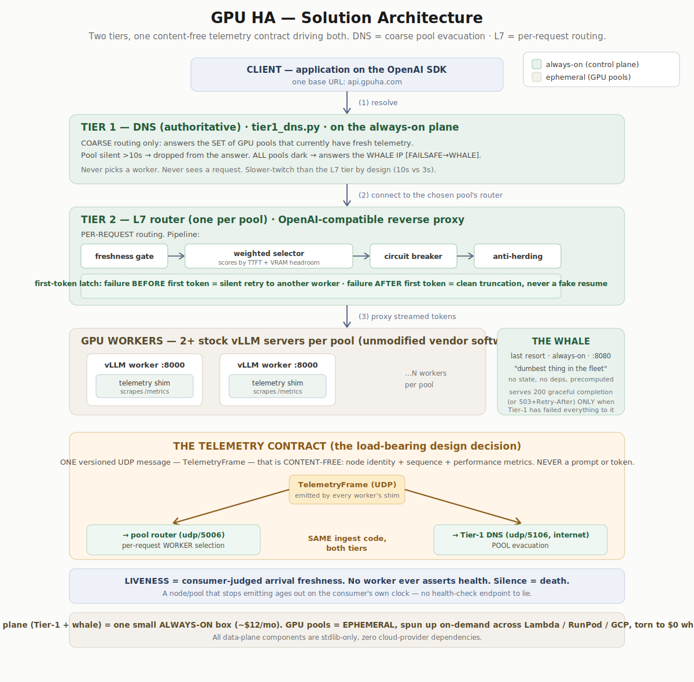

# GPU HA — High Availability & Disaster Recovery for LLM Inference

> **Two-tier failover for LLM inference workloads, drilled on real GPUs across three clouds.**
> DNS owns coarse cross-cloud pool evacuation; an L7 hop owns the per-request decision — including the
> honest contract for what happens when a GPU dies mid-generation. Open reference implementation and
> prior art. Clone it, run the drills, build your own HA/DR layer for inference on top.

**Status:** working proof-of-concept, proven on real infrastructure. Reference implementation, not a product.
**License:** Apache-2.0 · **Author:** Scott McDonald

---

## The one-paragraph version

LLM inference is becoming tier-1 infrastructure, but its availability story hasn't caught up. This project
demonstrates — rather than asserts — that DNS-based failover (the trick that worked for websites) solves
only *half* the problem for streaming inference, and draws the boundary precisely enough to put in code.
A streaming completion holds a connection open for 5–90 seconds, so DNS is out of the loop the moment the
socket opens; and public resolvers freeze a per-second routing decision for a full minute. So the design
splits cleanly: **DNS (Tier 1) evacuates whole pools/regions/clouds; an L7 router (Tier 2) picks the
worker per request and handles mid-stream death honestly.** One content-free telemetry frame drives both
tiers. When everything dies, a "fail-whale" returns a graceful, protocol-correct answer instead of a
connection error.

## Who this is for

- **"I need HA for my vLLM fleet in one region"** → you only need Tier 2 (the L7 router). Jump to
  [Quickstart](#quickstart), skip the DNS tier. Working in ~5 minutes, no GPU required for the demo.
- **"I need cross-cloud / cross-region DR"** → the whole thing. Read
  [the thesis](#the-thesis-where-dns-reach-ends) first, then the [manual](docs/BUILD_YOUR_OWN.md).
- **"My agent is building this for me"** → the [manual](docs/BUILD_YOUR_OWN.md)'s reproducible spec section is
  written as acceptance tests: exact commands, exact expected outputs, the drill matrix as pass/fail.
- **"I just want to understand the ideas"** → [the whitepaper](docs/WHITEPAPER.md) is the reasoning; the
  [diagrams](#architecture) are the picture; this README is the map.

## Quickstart (single-region HA demo, no GPU, ~5 min)

```bash
git clone https://github.com/<user>/<repo>.git
cd <repo>
pip install -r requirements.txt

# Start a few fake workers, the router, and watch failover happen locally — no GPU spend.
# (exact commands in BUILD_YOUR_OWN.md §4)
python router.py --port 9000 --telemetry-port 5006 --backend gpuha-w1=127.0.0.1:8011 --backend gpuha-w2=127.0.0.1:8012 &
python fake_worker.py --id gpuha-w1 --port 8011 --telemetry 127.0.0.1:5006 &
python fake_worker.py --id gpuha-w2 --port 8012 --telemetry 127.0.0.1:5006 &

# Send a request; kill a worker mid-stream; watch the router fail over silently.
curl -s localhost:9000/v1/chat/completions -H 'Content-Type: application/json' -d '{"model":"gpuha","messages":[{"role":"user","content":"hi"}],"max_tokens":8}'
```

The full drills (cross-cloud evacuation, the whale, real-GPU failover) and the orchestrator are documented
in [BUILD_YOUR_OWN.md](docs/BUILD_YOUR_OWN.md). The evidence for every claim below is in
[`docs/evidence/`](docs/evidence/) — real logs from real drills. This repo's proof is reproducibility, not
a demo video: run it yourself.

## The thesis: where DNS's reach ends

Website failover suited DNS because the failure was **coarse and sticky** — an origin died, new connections
needed to land elsewhere within seconds-to-a-minute, and a stale answer cost one failed page load. LLM
inference breaks that in two specific ways:

1. **The connection outlives the decision.** A streaming completion holds a socket open for 5–90s. DNS
   resolves once, at setup; after that it's out of the loop. No TTL is low enough to re-route a request
   already in flight.
2. **The decision is fast-moving and per-request.** "Which node has the lowest time-to-first-token and the
   most VRAM headroom *right now*" changes second to second. Public resolvers override TTL 0 with 20–60s
   minimum caching — freezing a per-second decision for a minute, for every client behind that resolver.

So: **DNS (Tier 1) owns what it's unbeatable at** — coarse pool evacuation (a region/cloud losing capacity,
telemetry going dark, cross-cloud disaster failover). **An L7 hop (Tier 2) owns the per-request decision** —
which worker serves this request, and what happens when it dies mid-stream. The discipline is knowing which
failure you have.

## Architecture

The system in one picture (full set in [`docs/diagrams/`](docs/diagrams/)):



Six views are included:
- **`d1_architecture`** — the full two-tier system and the shared telemetry contract.
- **`d2_demo`** — the five failover drills (baseline → intra-pool → mid-stream fail-fast → cross-cloud
  evacuation → whale finale).
- **`d3_harness`** — the client-traffic test harness that measures the *client* side of failover.
- **`d4_orchestrator`** — the `up`/`down`/`reap` lifecycle, teardown-first.
- **`d5_splitbrain`** — control-plane HA and the split-brain/witness problem (production design).
- **`d6_opencore`** — the boundary between the data plane and control plane.

### The load-bearing ideas

- **One content-free telemetry frame drives both tiers.** Identity + sequence + metrics — never a prompt or
  token. The router consumes it for per-request selection; the DNS tier consumes it — *same code* — for pool
  evacuation. That single shared contract is the core design decision.
- **The first-token contract.** Failure *before* the first token reaches the client is fully recoverable
  (silent retry to another worker). Failure *after* is not — tokens already streamed came from one worker's
  KV-cache; pretending to resume fabricates output. The honest behavior is a clean truncation and a
  client-level retry. Enforced as a one-way latch.
- **Liveness is the consumer's judgment: silence = death.** No worker ever asserts "I'm healthy." Each
  consumer judges liveness by telemetry arrival freshness against its own clock. A dead worker ages out; a
  zombie (VRAM full, no serving process) can't fool it.
- **The whale.** When all pools are dark, clients get a valid OpenAI-shaped graceful completion (or a
  503 + Retry-After the SDK auto-retries) — never connection-refused. The dumbest thing in the fleet by
  design: no state, no dependencies, precomputed responses. A last resort must share fate with nothing.

## What's in here

| Component | What it is |
|---|---|
| `router.py` | L7 OpenAI-compatible router: per-request selection, first-token latch, dual framing |
| `selection.py` | Freshness gate → weighted scoring → circuit breaker → anti-herding |
| `vllm_telemetry_shim.py` | Scrapes a *stock* vLLM server's `/metrics`, emits the telemetry frame |
| `tier1_dns.py` | Stdlib DNS responder: pool evacuation on telemetry silence, whale failsafe |
| `telemetry.py` | The versioned, content-free frame + the shared ingest both tiers use |
| `whale.py` | The graceful-degradation last-resort endpoint |
| `orchestrator/` | `gpuha up/down/reap` — acquire capacity across clouds, wire the fabric, tear to zero |
| `docs/` | The whitepaper, the manual, the diagrams, the drill evidence, the lessons |

Data-plane components are **stdlib-only** — zero cloud-provider dependencies, by design. The code runs
anywhere and the failover logic stays legible rather than buried in framework config.

## What this does NOT do (limitations, stated plainly)

- No mid-stream resume — by design; the honest contract truncates rather than fabricates.
- Scoring weights are hand-set, not learned.
- Production hardening is deferred and documented as issues: anycast whale, CoreDNS-native frame parsing,
  frame v2 (HMAC, epoch/boot-id), and control-plane HA (dual planes + a witness for split-brain — see
  `d5_splitbrain`).
- This is a **reference implementation and prior art**, not a product, SaaS, or managed service.

## Build your own

The whole point: [**BUILD_YOUR_OWN.md**](docs/BUILD_YOUR_OWN.md) is a practitioner's manual for standing up
HA/DR for your own inference workloads on top of this. A datacenter is just a pool; internal DNS actually
removes the TTL-floor problem, so DC-to-DC failover is *stronger* on-prem than on the public internet.
Blue/green and canary come nearly free (which pools the DNS tier advertises = coarse blue/green; router
weights = canary; the whale = maintenance mode).

Contributions welcome — see [CONTRIBUTING.md](CONTRIBUTING.md). Raising tide, all boats.

## A note on how this was built

This project was built as an experiment in *supervising* AI to build production infrastructure — a human
architect directing AI agents rather than writing most of the code by hand. The [whitepaper](docs/WHITEPAPER.md)
includes an honest account of that operating model: what worked, what broke, and where the judgment stayed
human. If you're figuring out how to build real systems with these tools, that part may be the most useful
thing here.

---

## About the author

**Scott McDonald** — 25+ years in cloud, security, and infrastructure; AWS Professional Services and GCP
security background; currently a Principal AI/Cloud/Security Architect. Two decades ago I built
**dnshat.com**, DNS-based failover for websites, back when people said caching made it impossible — it
worked, and it led to an AWS acquihire. GPU HA is the analogous question for the AI era: can the same
discipline route inference traffic around dying GPUs? This repo is the honest answer.

- Connect on LinkedIn: https://www.linkedin.com/in/gpuha
- Writing: the *Paracoding* series - Book 1 is live: https://a.co/d/0bdZMM8O

### Support the author

If this saved you time or taught you something, you can support the work by shopping at my other venture —
gourmet and functional mushrooms, grown at **[Seaside Mushrooms](https://shop.seasidemushrooms.com)**. And
keep an eye out for the *Paracoding* books (https://a.co/d/0bdZMM8O), which tell the story of how projects like this one get built.

---

*Apache-2.0. Use it, fork it, build on it. If you patent something and block me from using these patterns in
my own work, that would be deeply annoying — which is exactly why this is published as prior art.*
